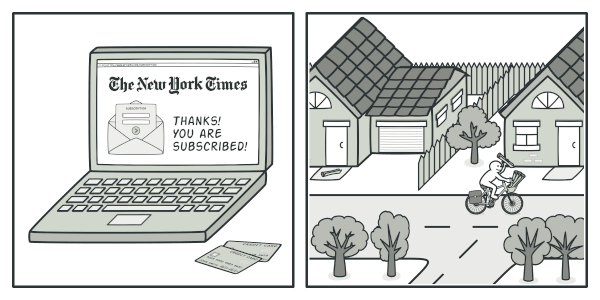
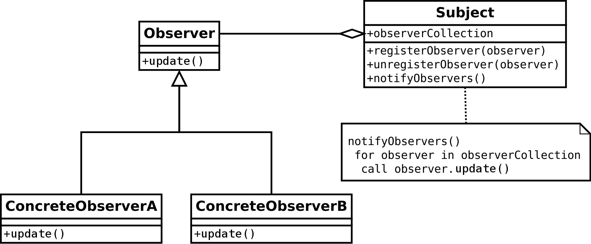
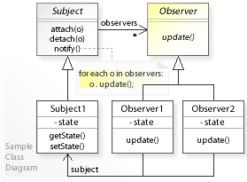
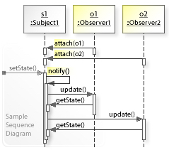
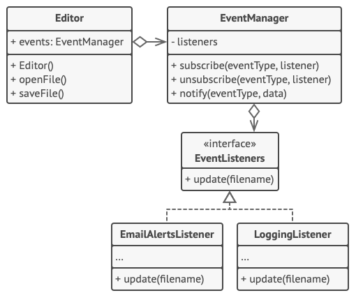

# Observer pattern

## References

- [Wikipedia](https://en.wikipedia.org/wiki/Observer_pattern)
- [Refactoring Guru](https://refactoring.guru/design-patterns/observer)
- [SourceMaking](https://sourcemaking.com/design_patterns/observer)

## Definition

Observer is a behavioral design pattern that lets you define a subscription mechanism to notify multiple objects about any events that happen to the object they’re observing.

### Analogy

## Structure

### Abstract class diagram

### Detailed class diagram

### Detailed sequence diagram

## Example

### Class diagram example with editor and manager

